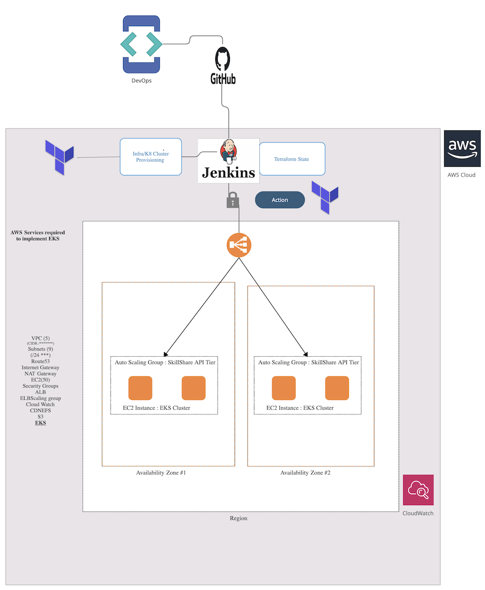
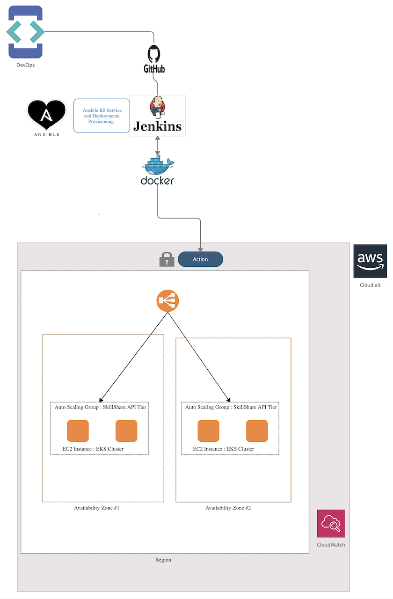

# EnterpriseProject

## University Name: http://www.sjsu.edu/ 
## Course: Enterprise SW Platform
## Professor: Andrew Bond
## Student: 
## Anupama Kurudi - https://www.linkedin.com/in/anupamakn/
## Gunjan Srivastava - https://www.linkedin.com/in/gunjan-android
## Shivam Tomar - [LinkedIn](https://www.linkedin.com/in/shivam-tomar/)
## Krishna Jha

## Skillshare Infra Automation  
Skillshare Continuous Delivery process that used to automate whole K8s release workflow, including managing configuration changes of a K8s Deployment, deployments of code changes, managing Dockerfile updates, building Docker images and pushing them to the Docker registry, applying new images on your K8s cluster, Stack used are Jenkins Server, DockerHub, Docker, Terraform, Ansible , Kubernetes EKS (Kubectl | K8 Continues deploy | K8 Credentials).

### K8 infra AWS ECS using Terraform git 

   
   
### Service Workload deployment

      
